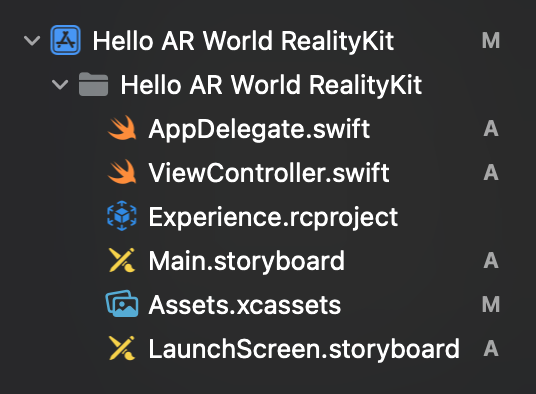

# Exploration of ARKit

This is an exploration of ARKit for Prof. Tobias Hollerer's CS291A course at UC Santa Barbara.

## Links

- [Apple's Augmented Reality general website](https://developer.apple.com/augmented-reality/)
- [Apple's ARKit website](https://developer.apple.com/augmented-reality/arkit/)
- [Apple's SDK and Betas website](https://developer.apple.com/download/)
- [Tutorial from Ray Wenderlich](https://www.raywenderlich.com/737368-beginning-arkit)
- [RealityKit discussion on RayWenderlich](https://www.raywenderlich.com/books/apple-augmented-reality-by-tutorials/v1.0/chapters/9-realitykit)

## Creating an AR Project in Xcode

Creating AR projects in Xcode is fairly easy, assuming you have the latest version of Apple's software. The version this document is made with is Xcode 13.2. This is often the way development works in the Apple ecosystem. It is expected that you will always be using the latest versions of everything.

First create a new project and choose Augmented Reality App:


Next you'll need to name your project and choose the technology you want to use. Apple offers 4 different technologies for rendering. The rendering technologies are discussed in [this Stack Overflow question](https://stackoverflow.com/questions/60505755/high-quality-rendering-realitykit-vs-scenekit-vs-metal).

The choices are:

- **RealityKit**—the newest technology, this is a high level sdk that enables many of the latest features like the use of the LiDAR scanner (and photogrammetry), ray-traced shadows, and multi-user support. It is not as customizable as SceneKit, but offers more features out of the box that are likely of interest to AR developers.
- **SceneKit**—this is Apple's 3D technology conceived for VR and 3D games. While SceneKit is older, it does offer [some functionality that is not available in RealityKit](https://medium.com/geekculture/the-top-9-most-in-demand-features-for-realitykit-3-0-c1a50f08909d). It is highly customizable, but has not been updated since 2017.
- **SpriteKit**—this is Apple's 2D game framework.
- **Metal**—this is Apple's low-level 3D framework for generating geometry very quickly. Metal underlies many graphics API's already. Metal shaders are written in C++. Metal should be considered when performance is critical.


## Exploring the Demo Projects

In the following explorations we'll look at the differences between 3 systems offered by Apple which seem like good candidates to use: RealityKit, SceneKit, and Metal.

In these explorations, I'll be:

1. Looking at the **default program templates** that Apple provides.
2. Looking at the **differences between the files included** in the Navigation Panel.
3. Looking at the **code differences in the ViewController.swift**.

### RealityKit Demo

When creating a project with the RealityKit demo, you're given a project structure like this:



`AppDelegate.swift` and `ViewController.swift` are standard elements of any Swift project. The contents of `AppDelegate.swift` file do not change between the templates, however `ViewController.swift` is unique in every project. The copletely unique file here is the `Experience.rcproject` file.

First let's look at `ViewController.swift`.

```swift
import UIKit
import RealityKit

class ViewController: UIViewController {
    
    @IBOutlet var arView: ARView!
    
    override func viewDidLoad() {
        super.viewDidLoad()
        
        // Load the "Box" scene from the "Experience" Reality File
        let boxAnchor = try! Experience.loadBox()
        
        // Add the box anchor to the scene
        arView.scene.anchors.append(boxAnchor)
    }
}
```

The `@IBOutlet` command initializes the main view that is set in the storyboard as an [`ARView` instance](https://developer.apple.com/documentation/realitykit/arview). This gets rid of a lot of boilerplate code that you might have to do if you were to do this programmatically.

The code above creates an anchor for the 3D object in the `.rcproject` file. `.rcproject` files are edited in [Apple's Reality Composer](https://developer.apple.com/documentation/realitykit/creating_3d_content_with_reality_composer) program. Clicking on the file will give you a project preview and the option of opening up the full program.


When you play the demo on a device, the program places the cube object wherever the center of the camera view is. It doesn't seem like the lighting is matched, but that may be because my lighting is fairly flat indoors.


Tracking is **excellent**, although as you can see in the demo, the object is not occluded by things that get in the way (like the lamp arm).

### SceneKit Demo

When creating a SceneKit demo file, the navigation panel looks like this:


Much of this is familiar, including the `AppDelegate.swift` and `ViewController file`. The new addition here is the `art.scnassets` object that has a `ship.scn` and a `texture.png` file in it.

According to documentation the `.scnassets` bundle is simply a folder that has the `.scnassets` extension on it. You can put all kinds of SceneKit assets in these folders and, at compile time, Xcode optimizes each of the assets for each target device ([source](https://developer.apple.com/documentation/scenekit/scnscenesource)).

The ship's geometry and texture are in the `art.scnassets` folder. It is possible to bring in other 3D models using the `.dae` or `.abc` file format. There is an option under the Editor pull-down menu to convert these formats to SceneKit's .scn format ([source](https://www.youtube.com/watch?v=jEFpbNErGsE)).

The ViewController.swift file seems more complex than the RealityKit template, but it is essentially doing the same thing. Much of the include code is just boilerplate overrides that you can actually delete.

```swift
import UIKit
import SceneKit
import ARKit

class ViewController: UIViewController, ARSCNViewDelegate {

    @IBOutlet var sceneView: ARSCNView!
    
    override func viewDidLoad() {
        super.viewDidLoad()
        
        // Set the view's delegate
        sceneView.delegate = self
        
        // Show statistics such as fps and timing information
        sceneView.showsStatistics = true
        
        // Create a new scene
        let scene = SCNScene(named: "art.scnassets/ship.scn")!
        
        // Set the scene to the view
        sceneView.scene = scene
    }
    
    override func viewWillAppear(_ animated: Bool) {
        super.viewWillAppear(animated)
        
        // Create a session configuration
        let configuration = ARWorldTrackingConfiguration()

        // Run the view's session
        sceneView.session.run(configuration)
    }
    
    override func viewWillDisappear(_ animated: Bool) {
        super.viewWillDisappear(animated)
        
        // Pause the view's session
        sceneView.session.pause()
    }

    // MARK: - ARSCNViewDelegate
    
/*
    // Override to create and configure nodes for anchors added to the view's session.
    func renderer(_ renderer: SCNSceneRenderer, nodeFor anchor: ARAnchor) -> SCNNode? {
        let node = SCNNode()
     
        return node
    }
*/
    
    func session(_ session: ARSession, didFailWithError error: Error) {
        // Present an error message to the user
        
    }
    
    func sessionWasInterrupted(_ session: ARSession) {
        // Inform the user that the session has been interrupted, for example, by presenting an overlay
        
    }
    
    func sessionInterruptionEnded(_ session: ARSession) {
        // Reset tracking and/or remove existing anchors if consistent tracking is required
        
    }
}

```

In the SceneKit template the main view is an instance of the [`ARSCNView`](https://developer.apple.com/documentation/arkit/arscnview) type.

Again, when the demo is launched, the model that is accessed is placed relative to the center of the camera view. I believe this model is elevated within its scene, so it is elevated in the `ARSCNView` as well and on screen.


The view is largely the same. Since SceneKit is **node-based**, you see a count of nodes at the bottom of the screen of the fps for optimization purposes.